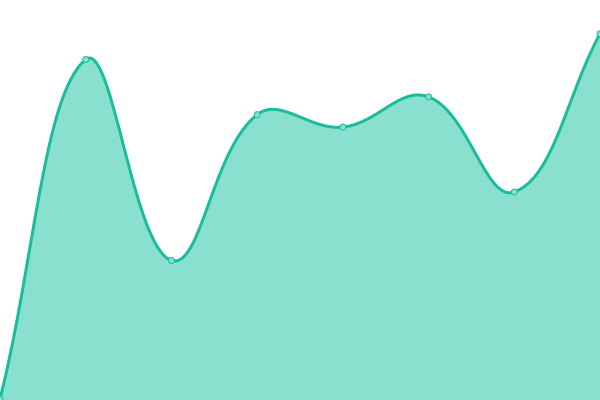

# [📈 Live Status](https://uptime.pawbyte.com): <!--live status--> **🟩 All systems operational**

This repository contains the open-source uptime monitor and status page for [PawByte](http://www.pawbyte.com), powered by [Upptime](https://github.com/upptime/upptime).

With [Upptime](https://upptime.js.org), you can get your own unlimited and free uptime monitor and status page, powered entirely by a GitHub repository. We use [Issues](https://github.com/pawbyte/uptime/issues) as incident reports, [Actions](https://github.com/pawbyte/uptime/actions) as uptime monitors, and [Pages](https://uptime.pawbyte.com) for the status page.

<!--start: status pages-->
<!-- This summary is generated by Upptime (https://github.com/upptime/upptime) -->
<!-- Do not edit this manually, your changes will be overwritten -->
<!-- prettier-ignore -->
| URL | Status | History | Response Time | Uptime |
| --- | ------ | ------- | ------------- | ------ |
|  [PawByte](https://pawbyte.com) | 🟩 Up | [paw-byte.yml](https://github.com/pawbyte/uptime/commits/HEAD/history/paw-byte.yml) | 

 3112ms
     
 | 

<a href="https://uptime.pawbyte.com/history/paw-byte">100.00%</a>
    

|  [Email](https://email.pawbyte.com) | 🟩 Up | [email.yml](https://github.com/pawbyte/uptime/commits/HEAD/history/email.yml) | 

 328ms
     
 | 

<a href="https://uptime.pawbyte.com/history/email">99.82%</a>
    

|  [Game Pencil](https://gamepencil.net) | 🟩 Up | [game-pencil.yml](https://github.com/pawbyte/uptime/commits/HEAD/history/game-pencil.yml) | 

 1976ms
     
 | 

<a href="https://uptime.pawbyte.com/history/game-pencil">100.00%</a>
    

|  [Visit Gary](https://visitgary.net) | 🟩 Up | [visit-gary.yml](https://github.com/pawbyte/uptime/commits/HEAD/history/visit-gary.yml) | 

 572ms
     
 | 

<a href="https://uptime.pawbyte.com/history/visit-gary">100.00%</a>
    

|  [Nathan Hurde](https://nathanhurde.com) | 🟩 Up | [nathan-hurde.yml](https://github.com/pawbyte/uptime/commits/HEAD/history/nathan-hurde.yml) | 

 777ms
     
 | 

<a href="https://uptime.pawbyte.com/history/nathan-hurde">100.00%</a>
    

<!--end: status pages-->

[**Visit our status website →**](https://uptime.pawbyte.com)

## 📄 License

- Powered by: [Upptime](https://github.com/upptime/upptime)
- Code: [MIT](./LICENSE) © [PawByte](http://www.pawbyte.com)
- Data in the `./history` directory: [Open Database License](https://opendatacommons.org/licenses/odbl/1-0/)
